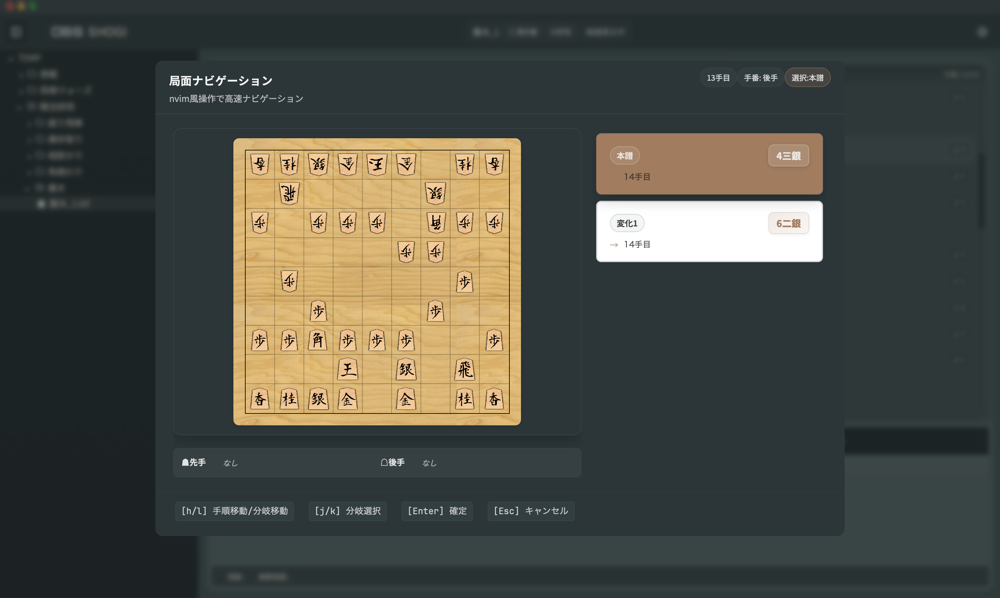

# ObsShogi

[](./LICENSE.md)


**将棋の研究・棋譜管理に特化したGUIアプリ（Tauri）**  
対局機能は付けず、棋譜の整理／横断／検索／局面検索と、USI対応エンジンによる検討にフォーカスします。

- 対応OS: Windows / macOS / Linux
- 配布: Releases
- ライセンス: **Shogi App License（商用利用可・改変不可）**  
  → 再配布は **無改変のみ** 許可（詳細は [`LICENSE.md`](./LICENSE.md)）

---

## 目次

- [About](#about)
- [Features](#features)
- [Concept](#concept)
- [Usage](#usage)
- [Engine (USI)](#engine-usi)
- [Development](#development)
- [Directory Structure](#directory-structure)
- [Roadmap](#roadmap)
- [Contributing](#contributing)
- [License](#license)

---

## About

既存の将棋GUI（例: ShogiGUI / ShogiHome など）は、対局・検討まで含めた完成度の高いソフトが揃っています。  
一方で「研究のワークフロー（棋譜の切り替え、整理、関連付け、検索、局面検索）」に最適化された体験は、私の知る限り多くありません。

ObsShogi は **“研究の導線”** を中心に設計し、ルートディレクトリ配下の棋譜を前提としたナビゲーションと、横断検索・局面検索で研究を加速します。

---

## Features

- 棋譜の読み込み（KIF / CSA / SFEN / JKF）
- 指し手の適用・分岐の作成／削除・局面再生
- 検討（USIエンジン連携）
- **局面ナビゲーション（NeoVim的な j/k/h/l 操作で分岐を高速移動）**
- **局面検索（任意局面をキーに、ルート配下の棋譜から一致局面を横断検索）**
- ファイルツリービュー（ルートディレクトリ配下の棋譜を管理）

---

## Concept

ObsShogi は “ノートアプリ的な感覚” で棋譜を扱うことを目指しています。

- **ルートディレクトリ**を 1 つ決め、配下の棋譜をまとめて扱う
- ツリーで素早く移動し、研究対象を頻繁に切り替える
- 検索／局面検索で「似た局面」「関連する棋譜」を横断する

加えて、将来的には **人間の認知（記憶・理解・比較）のしやすさ** を軸に、研究データを整理できる仕組みを拡張していきます。

- **タグ**（戦型・囲い・狙い・テーマ・自分用メモ…）
- **コメント**（局面の気づき、評価の根拠、次回の課題）
- **局面の重要度整理**（頻出局面／学びが大きい局面／要復習…）
- それらを前提にした **「研究の管理システム」**（検索・再利用・比較・復習が回る導線）

> 現時点ではコメント／タグ等は未搭載で、開発予定です。

---

## Usage

1. ルートディレクトリを設定
2. 棋譜を追加（フォルダに配置／アプリから作成）
3. ツリーから棋譜を開いて再生
4. 必要に応じて分岐を作成し、検討へ

### 局面ナビゲーション（分岐を“編集点”として素早く渡る）

局面再生中に、分岐を **NeoVimライクなキー操作（j/k/h/l）** で渡れるビューを用意しています。  
「分岐を読む／選ぶ／切り替える」が速くなり、研究のテンポを落としません。



- **j / k**：候補（分岐・手順）を上下に移動
- **h / l**：分岐の切り替え・階層移動（“枝分かれ”を辿る）
- キーボード中心の操作で、マウス往復を減らして研究導線を短くします

※キー割り当ての詳細は今後ドキュメント化（またはアプリ内ヘルプ）予定。

### 局面検索（任意局面から、関連棋譜を一気に見つける）

任意の局面を検索キーにして、ルート配下の棋譜から **一致局面を横断検索** できます。  
研究中の局面が「どの棋譜の何手目に出てくるか」を一気に拾える想定です。


#### 検索範囲（現状の仕様）

検索対象は **“ルートディレクトリ配下の棋譜ファイル”** です。

- 検索範囲：**ルートディレクトリ配下の棋譜ファイル**
- 対象：棋譜ファイル（例：KIF / CSA / SFEN / JKF）

> 研究用途として「このフォルダだけ探したい」等の需要もあるため、検索範囲のスコープ指定（ディレクトリ単位など）は Roadmap にて検討しています。

---

## Engine (USI)

ObsShogi は **USI（Universal Shogi Interface）** に対応した思考エンジンを利用できます。  
USI は将棋GUIとエンジンが通信するためのプロトコルです。  
参考: [USIプロトコルとは（将棋所）](https://shogidokoro2.stars.ne.jp/usi.html)

### セットアップ（例）

1. USI対応エンジン（実行ファイル）を用意
2. アプリの設定画面でエンジンのパスを登録
3. 検討を開始（局面送信 → 解析結果表示）

> エンジンの種類によっては追加オプション（Hash / Threads 等）の設定が必要です。

---

## Development

### Prerequisites

- Rust (stable)
- Node.js (LTS 推奨)
- npm（このリポジトリは `package-lock.json` を採用）

### Setup

```bash
npm install
npm run tauri dev
```
