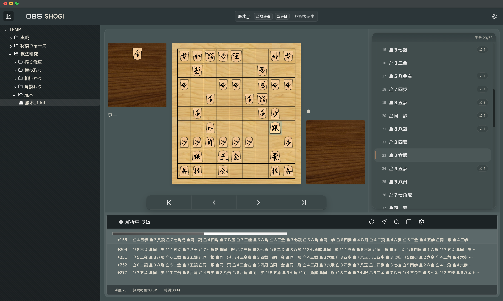
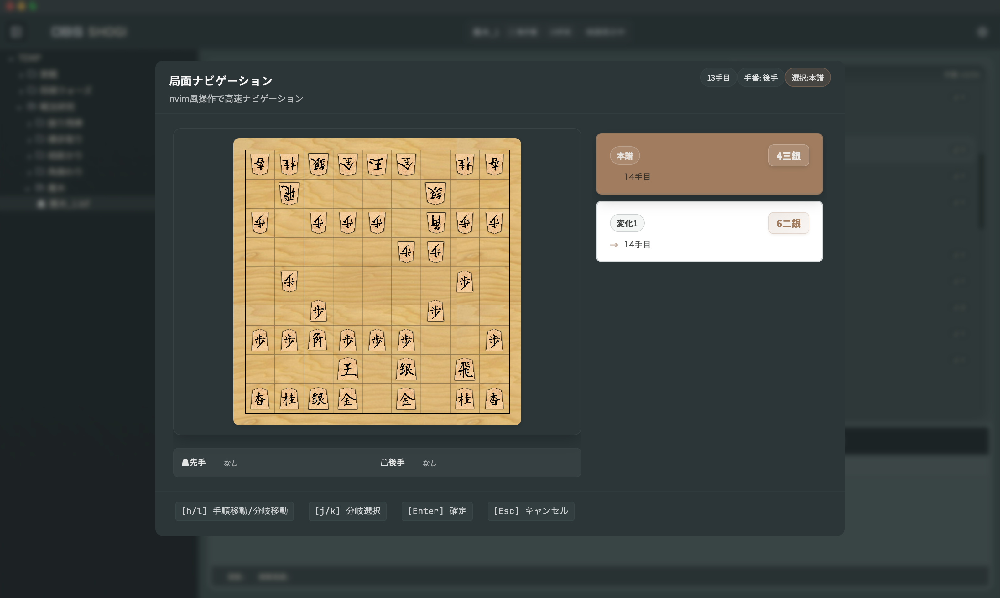
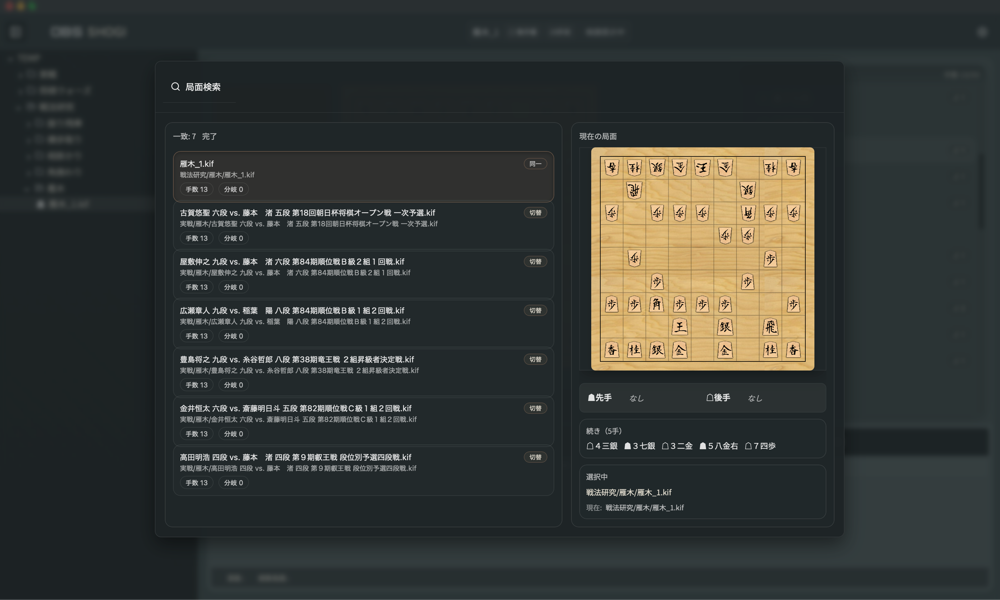

# ObsShogi

[](./LICENSE)



**定跡・序盤研究に特化した将棋GUIアプリ**  
局面検索、棋譜ツリー管理、USIエンジンによる検討に対応。

> [!IMPORTANT]
> **最新版のダウンロードはこちら**  
> → [Releases からダウンロード](https://github.com/Rioh1118/obs-shogi/releases/latest)

> [!NOTE]
> 現在は **Beta版** です。動作改善や機能追加を継続中です。

- 対応OS: Windows / macOS / Linux
- 配布: Releases
- ライセンス: **MIT License**

---

## 目次

- [About](#about)
- [Features](#features)
- [Concept](#concept)
- [Usage](#usage)
- [Engine (USI)](#engine-usi)
- [Development](#development)
- [Contributing](#contributing)
- [License](#license)

---

## About

既存の将棋GUI（例: ShogiGUI / ShogiHome など）は、対局・検討まで含めた完成度の高いソフトが揃っています。  
一方で、**研究のワークフロー**──棋譜の切り替え、整理、関連付け、検索、局面検索──に最適化された体験は、私の知る限り多くありません。

ObsShogi は、こうした **「研究の導線」** を中心に設計した将棋GUIです。  
ルートディレクトリ配下の棋譜を前提に、ナビゲーション・横断検索・局面検索を組み合わせ、定跡研究や序盤研究を進めやすくすることを目指しています。

---

## Features

- 棋譜の読み込み（KIF / CSA / SFEN / JKF）
- 指し手の適用・分岐の作成／削除・局面再生
- 検討（USIエンジン連携）
- **局面ナビゲーション**（NeoVim的な `j / k / h / l` 操作で分岐を高速移動）
- **局面検索**（任意局面をキーに、ルート配下の棋譜から一致局面を横断検索）
- ファイルツリービュー（ルートディレクトリ配下の棋譜を管理）

---

## Concept

ObsShogi は、“ノートアプリ的な感覚” で棋譜を扱うことを目指しています。

- **ルートディレクトリ**を 1 つ決め、配下の棋譜をまとめて扱う
- ツリーで素早く移動し、研究対象を頻繁に切り替える
- 検索 / 局面検索で「似た局面」「関連する棋譜」を横断する

加えて将来的には、**人間の認知（記憶・理解・比較）のしやすさ** を軸に、研究データを整理できる仕組みへ拡張していく予定です。

- **タグ**（戦型・囲い・狙い・テーマ・自分用メモ など）
- **コメント**（局面の気づき、評価の根拠、次回の課題）
- **局面の重要度整理**（頻出局面 / 学びが大きい局面 / 要復習 など）
- それらを前提にした **研究の管理システム**（検索・再利用・比較・復習が回る導線）

> 現時点ではコメント / タグ等は未搭載で、今後の開発項目です。

---

## Usage

1. ルートディレクトリを設定
2. 棋譜を追加（フォルダに配置 / アプリから作成）
3. ツリーから棋譜を開いて再生
4. 必要に応じて分岐を作成し、検討する

### 局面ナビゲーション

局面再生中に、分岐を **NeoVimライクなキー操作（`j / k / h / l`）** で辿れるビューを用意しています。  
「分岐を読む / 選ぶ / 切り替える」を素早く行え、研究のテンポを落としません。



- **j / k**: 候補（分岐・手順）を上下に移動
- **h / l**: 分岐の切り替え・階層移動
- キーボード中心の操作で、マウス往復を減らして研究導線を短くします

> キー割り当ての詳細は、今後ドキュメント化またはアプリ内ヘルプで案内予定です。

### 局面検索

任意の局面を検索キーにして、ルート配下の棋譜から **一致局面を横断検索** できます。  
研究中の局面が「どの棋譜の何手目に出てくるか」を一気に拾える想定です。



#### 検索範囲（現状の仕様）

検索対象は **ルートディレクトリ配下の棋譜ファイル** です。

- 検索範囲: **ルートディレクトリ配下の棋譜ファイル**
- 対象: 棋譜ファイル（KIF / CSA / SFEN / JKF など）

> 研究用途として「このフォルダだけ探したい」などの需要もあるため、検索範囲のスコープ指定（ディレクトリ単位など）は Roadmap で検討しています。

---

## Engine (USI)

ObsShogi は **USI（Universal Shogi Interface）** に対応した思考エンジンを利用できます。  
USI は、将棋GUIとエンジンが通信するための標準的なプロトコルです。  
参考: [USIプロトコルとは（将棋所）](https://shogidokoro2.stars.ne.jp/usi.html)

### セットアップ例

1. USI対応エンジン（実行ファイル）を用意
2. アプリの設定画面でエンジンのパスを登録
3. 検討を開始する（局面送信 → 解析結果表示）

> エンジンによっては、`Hash` や `Threads` など追加オプションの設定が必要です。

---

## Development

### Prerequisites

- Rust (stable)
- Node.js (LTS 推奨)
- npm（このリポジトリは `package-lock.json` を採用）

### Setup

```bash
npm install
npm run tauri dev
```

---

## Contributing

Issue / Pull Request を歓迎します。

ObsShogi は、**研究・序盤研究のワークフローに特化した将棋GUI** として開発しています。
一方で、将棋AIや研究実務の細かなユースケースについては、開発者がまだ十分に把握しきれていない部分があります。

そのため、以下のような報告は特に助かります。

- 不具合報告
- 研究用途で欲しい機能
- 将棋AI / USI 利用時の改善提案
- UI / UX の課題
- ドキュメント改善

詳細は [`CONTRIBUTING.md`](./CONTRIBUTING.md) を参照してください。

---

## License

This project is licensed under the [MIT License](./LICENSE).
