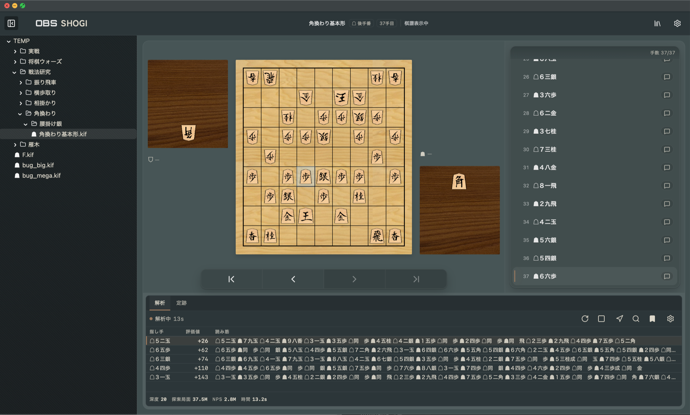
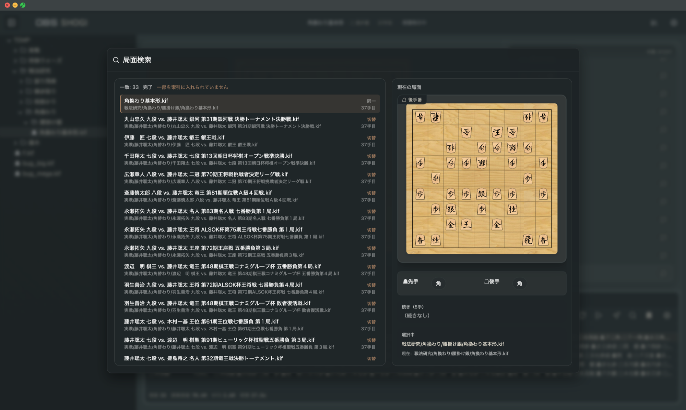

<div align="center">


# ObsShogi

**棋譜のフォルダを、そのまま研究の場所にする将棋 GUI**

Windows / macOS / Linux

[](https://github.com/Rioh1118/obs-shogi/releases/latest)
[](./LICENSE.md)

</div>



フォルダを1つ選ぶと、その下の棋譜がすべてツリーに並びます。
戦型ごと・大会ごとに分けたフォルダをそのまま行き来して、開いて、検討して、書き足す。
棋譜は普通のファイルのままなので、エディタや Git や同期サービスとも一緒に使えます。

> [!NOTE]
> Beta 版です。棋譜ファイルは直接書き換えるので、大事な棋譜はバックアップを取ってから使ってください。

## できること

### フォルダ単位で棋譜を管理する

ツリーから棋譜とフォルダを作る・名前を変える・移動する・消す。
アプリの外でファイルを足したり動かしたりしても、検索の索引はそれに追いつきます。

読み書きできる形式は KIF / KI2 / CSA / JKF。SFEN か盤の上で組んだ局面から、新しい棋譜を始めることもできます。

### フォルダ全体から局面を探す

いま盤に出ている局面が、フォルダ下のどの棋譜の何手目に現れるかを一度に引きます。
分岐の中の局面も対象です。

約600局・8.7万局面のフォルダで、索引を作るのに 0.4 秒、検索1回は 0.1 ミリ秒を切ります
（Apple M1 Pro / 10 コアで計測）。



### 分岐をキーボードでたどる

分岐の多い研究棋譜を、`h` `j` `k` `l` で辿れる画面があります。

### エンジンで検討する

USI エンジンを登録して、いまの局面を検討できます。候補手は複数本（MultiPV）並べられます。
やねうら王形式（`.db`）の定跡を開き、局面ごとの登録手を見ることもできます。

### 課題局面を溜める

「あとで調べたい局面」を登録して、状態とタグで整理できます。
棋譜ではなく局面に紐づくので、別の棋譜で同じ局面に着いても1つとして扱います。

## インストール

[Releases](https://github.com/Rioh1118/obs-shogi/releases/latest) から OS に合うものを取ってください。
新しい版が出るとアプリの中で知らせ、そのまま更新できます。

| OS      | ファイル                                                               |
| ------- | ---------------------------------------------------------------------- |
| Windows | `…-windows-x64-setup.exe` または `.msi`                                |
| macOS   | `…-darwin-aarch64.dmg`（Apple シリコン）／ `…-darwin-x64.dmg`（Intel） |
| Linux   | `.AppImage` / `.deb` / `.rpm`                                          |

macOS 版は Apple の公証を受けていません。
「壊れているため開けません」と出たら、アプリケーションフォルダに入れたあと次を一度だけ実行してください。

```bash
xattr -dr com.apple.quarantine /Applications/ObsShogi.app
```

## エンジンの設定

USI（[将棋所の説明](https://shogidokoro2.stars.ne.jp/usi.html)）に対応したエンジンなら使えます。
設定画面でエンジンの実行ファイルを登録し、必要なら `Threads` や `Hash` などのオプションを入れてください。

## これから

局面編集、棋譜の情報の編集、特殊な手（投了など）の挿入、定跡の書き込み、対局を予定しています。
いま画面に何があって何が無いかは [`docs/spec/`](./docs/spec/README.md) にまとめてあります。

## 開発に参加する

Issue も Pull Request も歓迎します。研究で困ったこと、欲しい機能、USI エンジンまわりの使いにくさの報告は特に助かります。
開発環境の作り方と進め方は [`CONTRIBUTING.md`](./CONTRIBUTING.md) にあります。

## ライセンス

[MIT License](./LICENSE.md)。

配布しているバイナリには、同梱している書体（OFL-1.1）をはじめ第三者のソフトウェアが含まれます。
その著作権表示とライセンス本文は [`THIRD-PARTY-NOTICES.md`](./THIRD-PARTY-NOTICES.md) にまとめてあり、
アプリと同じ場所に同梱して配布しています。
